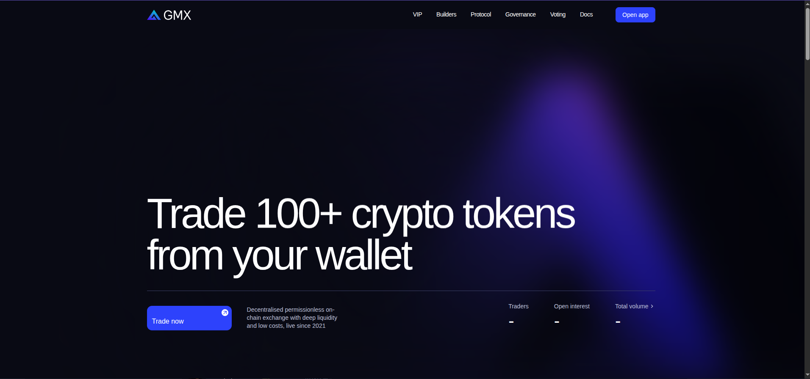
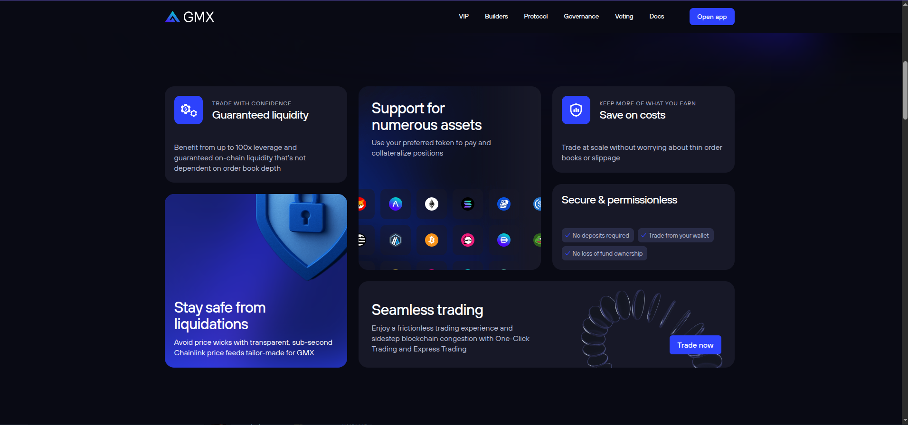
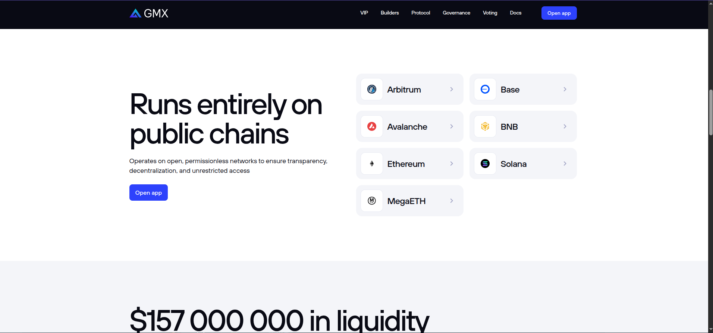
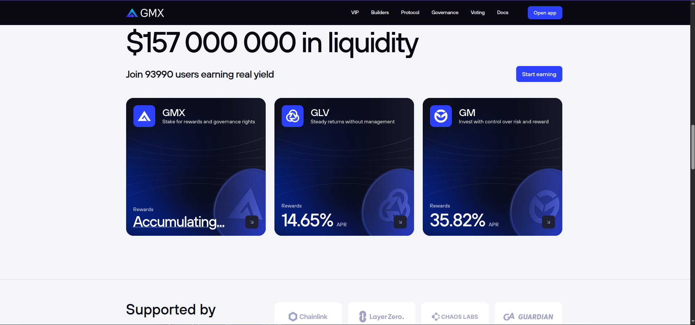
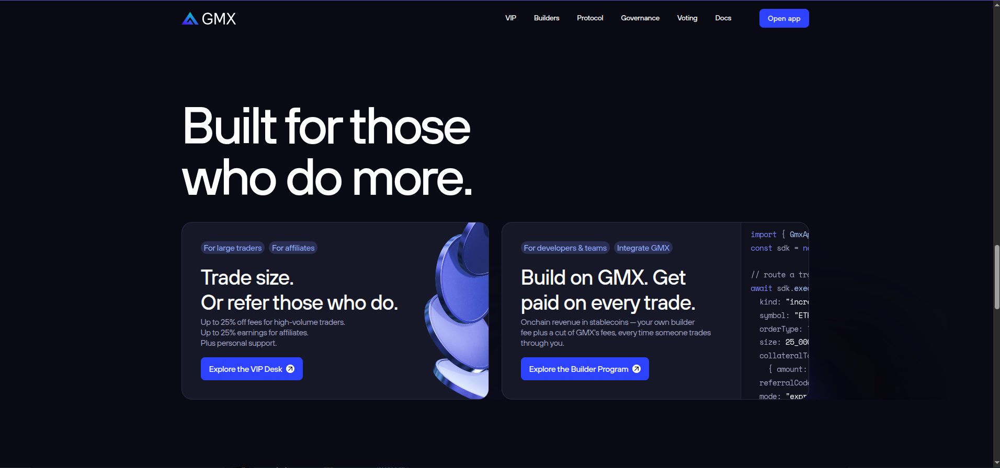
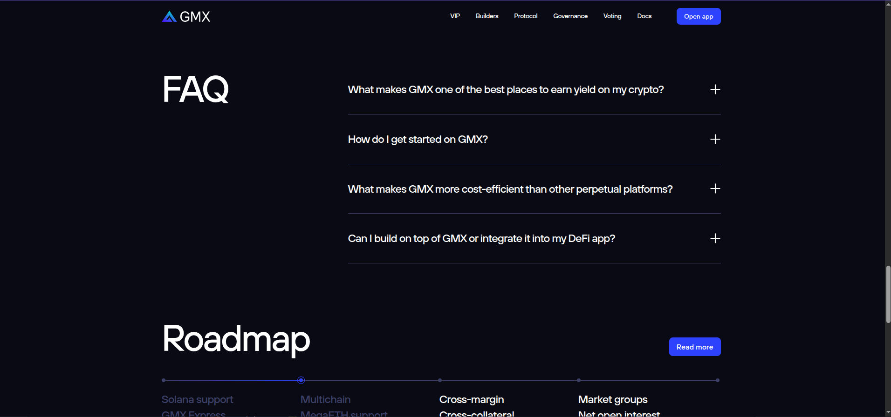
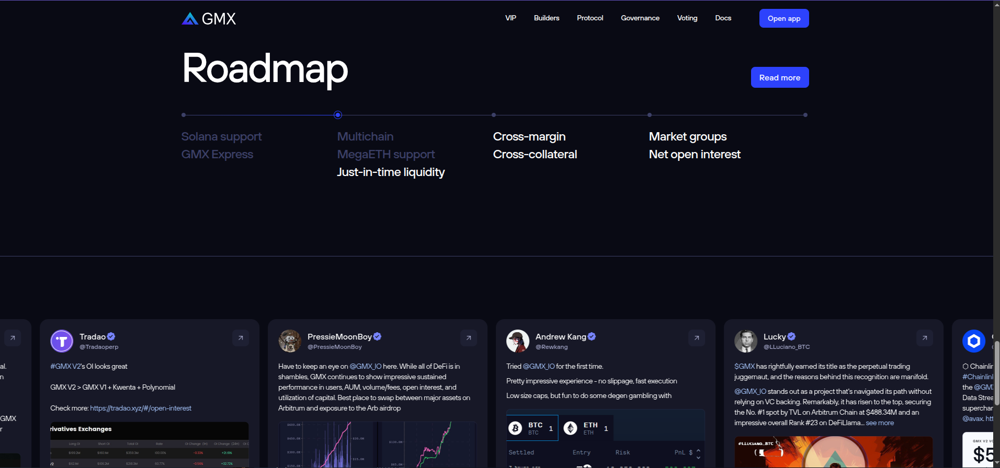
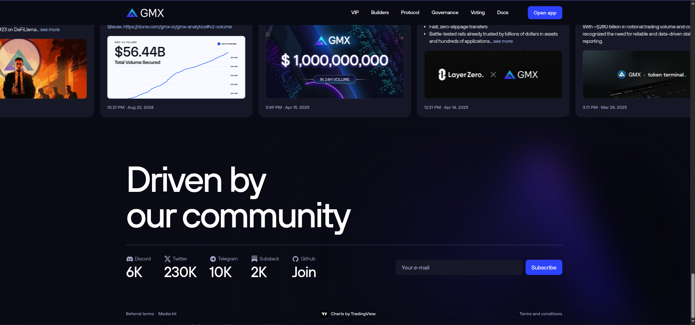

# GF3 — Landing Page: GMX Replica Spec

Full structural spec for rebuilding SO4's landing page (`/`) as a faithful replica of
GMX's landing. Companion to [`001_theme_update.md`](./001_theme_update.md) (theme
tokens) and the issues in [`grantforx_issues.md`](./grantforx_issues.md).

- **Source:** `gmx-io/gmx-interface`, branch `release`, folder `landing/`
- **Pinned commit:** `e27759a2835c7dc2197f41b6a6043bf07b935621` (all links below use it)
- **Live reference:** <https://gmx.io>
- **Entry point:** [`landing/src/pages/Home/Home.tsx`](https://github.com/gmx-io/gmx-interface/blob/e27759a2835c7dc2197f41b6a6043bf07b935621/landing/src/pages/Home/Home.tsx)
- **SO4 target:** `apps/web/src/routes/index.tsx` + `apps/web/src/ui/landing/*`
  (Vite + TanStack Router — not Next.js, not react-router)

## Page anatomy

GMX renders these sections in this exact order:
500NigerianDevs$$
```
HeaderMenu          fixed top nav, dark
HeroSection         dark — animated headline, CTA, live stats, feature grid
LaunchSection       LIGHT (pure white) — chain launcher grid
LiqiuditySection    LIGHT (#F4F5F9) — liquidity total + pool cards
SponsorsSection     LIGHT (#F4F5F9) — "Supported by" logo row
ProgramCards        dark — VIP / affiliate program cards
FaqSection          dark — accordion, 4 items
RoadmapSection      dark — horizontal quarter timeline
SocialSection       dark — tweet marquee + community stats + newsletter + FOOTER LINKS
```

There is **no separate footer component** — `SocialSection` ends with the footer link
row (Referral terms / Media kit / Terms and conditions / "Charts by TradingView").

Global layout constants (from the theme doc): content column `max-w 1200px`,
gutters `px-16 sm:px-40`, section rhythm `py-80 sm:py-[120px]`, hairline
`border-1/2 border-slate-600` separators, `duration-180` transitions everywhere.
Body wrapper (`App.tsx`): `overflow-hidden proportional-nums text-white`.

## Section map: GMX → SO4

| GMX section | SO4 current (`apps/web/src/ui/landing/`) | Action |
|---|---|---|
| HeaderMenu | `Navbar` (`variant="landing"`) | Restructure to GMX layout |
| HeroSection | `hero.tsx` + `stats.tsx` | Replace (stats fold into hero) |
| Features (inside hero) | `features.tsx` | Replace with GMX card grid |
| LaunchSection | — (no equivalent) | **New** |
| LiqiuditySection | `markets.tsx` (closest) | Replace with pool-card layout |
| SponsorsSection | — (no equivalent) | **New** (SO4 partners/infra logos) |
| ProgramCards | `how-it-works.tsx` slot | Replace |
| FaqSection | — (no equivalent) | **New** |
| RoadmapSection | `infrastructure.tsx` slot | Replace |
| SocialSection (footer) | `final-cta.tsx` + `footer.tsx` | Merge & replace |

---

## 1. HeaderMenu

**Source:** [`HeaderMenu/HeaderMenu.tsx`](https://github.com/gmx-io/gmx-interface/blob/e27759a2835c7dc2197f41b6a6043bf07b935621/landing/src/pages/Home/HeaderMenu/HeaderMenu.tsx)

Fixed (`fixed top-0 z-30`), `bg-slate-900`, content row `px-16 py-12 sm:px-40
sm:py-16`, inner width 1200px.

- **Left:** logo SVG, `h-20 sm:h-24`, links to `/`.
- **Center-right nav** (desktop only, `hidden sm:flex`): 14px medium, tracking
  `-0.448px`, `gap-22`, hover `text-white/80`, active `text-white/60`. GMX's links:
  VIP → `/trader-affiliate-program` · Builders → `/builders` · Protocol → GitHub ·
  Governance → gov forum · Voting → Snapshot · Docs → docs site.
  **SO4 links:** Trade → `/trade` · Pools → `/pools` · Earn → `/earn` · Referrals →
  `/referrals` · Docs → docs URL.
- **Right:** `btn-landing` "Open app", `rounded-8 px-16 py-10 text-14`.
- **Mobile:** burger (`size-36 rounded-8`, `bg-slate-700` when open) toggles a
  full-screen menu: links stacked with `border-t-1/2 border-slate-600` hairlines,
  full-width "Open app" button, then `Driven by our community` + social icon row
  pinned to the bottom.

📷 **Reference:** the header (desktop, closed) is visible at the top of
[`screenshots/hero-desktop.png`](./screenshots/hero-desktop.png). Still needed:
`header-mobile-closed.png`, `header-mobile-open.png`.

## 2. HeroSection

**Source:** [`HeroSection/HeroSection.tsx`](https://github.com/gmx-io/gmx-interface/blob/e27759a2835c7dc2197f41b6a6043bf07b935621/landing/src/pages/Home/HeroSection/HeroSection.tsx) ·
[`AnimatedTitle.tsx`](https://github.com/gmx-io/gmx-interface/blob/e27759a2835c7dc2197f41b6a6043bf07b935621/landing/src/pages/Home/HeroSection/AnimatedTitle.tsx) ·
[`Features.tsx`](https://github.com/gmx-io/gmx-interface/blob/e27759a2835c7dc2197f41b6a6043bf07b935621/landing/src/pages/Home/HeroSection/Features.tsx) ·
backgrounds: `HeroBackground.tsx`, `ProtectionBackground.tsx`, `SeamlessBackground.tsx`, `ChainIcons.tsx`

Dark (`bg-slate-900`), container `relative h-[640px] py-60 sm:h-[860px] sm:py-80`,
animated canvas background (chain constellation graphic), content pinned to the
bottom (`flex flex-col justify-end`).

**Headline** — `text-heading-1` (50px→100px), bottom hairline
`sm:border-b-1/2 border-b-slate-600 pb-28 sm:pb-36`:

> **Trade** ⌇rotating word⌇ **from your wallet**

The rotating word swaps every 2.5s through:
`with 100x leverage` → `100+ crypto tokens` → `multiple asset classes` →
`deep liquid markets` → `from 7 blockchains` — framer-motion `AnimatePresence`,
`y: 98→0→−98` + opacity, 0.25s easeInOut. **SO4 rotation** (proposed): keep GMX's
first/last, adapt the rest to SO4 markets (final copy in GF3-003).

**Sub-row** (below hairline, `flex justify-between`):
- `btn-landing` "Trade now" (`w-full sm:w-[200px]`, white circular arrow chip
  top-right inside the button).
- Subheadline (`text-subheadline`, `sm:w-[226px]`): *"Decentralised permissionless
  on-chain exchange with deep liquidity and low costs, live since 2021"* → SO4
  equivalent copy.
- **Live stats** (right side, `gap-36 sm:gap-60`): label `12px→14px slate-400`,
  value `30px→40px` medium `tracking-tight`:
  `Traders` · `Open interest` · `Total volume` (the last is a link — hover turns
  label `blue-300` and chevron translates right; opens Dune analytics).
  Data: [`useTraders`](https://github.com/gmx-io/gmx-interface/blob/e27759a2835c7dc2197f41b6a6043bf07b935621/landing/src/pages/Home/hooks/useTraders.ts),
  [`useTotalVolume`](https://github.com/gmx-io/gmx-interface/blob/e27759a2835c7dc2197f41b6a6043bf07b935621/landing/src/pages/Home/hooks/useTotalVolume.ts),
  `usePoolsData` (open interest), formatted by
  [`utils/formatters.ts`](https://github.com/gmx-io/gmx-interface/blob/e27759a2835c7dc2197f41b6a6043bf07b935621/landing/src/pages/Home/utils/formatters.ts)
  (`shortFormat` → `230K / 5M / 1B`, `shortFormatUsd`). **SO4:** wire to our
  indexer/stats API; `-` placeholder until loaded, exactly like GMX.

**Feature grid** (still inside HeroSection, `lg:grid-cols-3 lg:grid-rows-3 gap-24`,
`py-80 lg:py-[120px]`) — 6 cards, `rounded-20`, mostly `bg-slate-800`:

| Card | Eyebrow → Title | Body | Visual |
|---|---|---|---|
| Guaranteed liquidity | `Trade with confidence` → `Guaranteed liquidity` | "Benefit from up to 100x leverage and guaranteed on-chain liquidity that's not dependent on order book depth" | IconBox (gears), hairline under header |
| Stay safe from liquidations | — | "Avoid price wicks with transparent, sub-second Chainlink price feeds tailor-made for GMX" | **Blue `bg-blue-400` card**, protection shield image, spans 2 rows |
| Support for numerous assets | — | "Use your preferred token to pay and collateralize positions" | Chain icon cluster (`ChainIcons`), spans 2 rows |
| Save on costs | `Keep more of what you earn` → `Save on costs` | "Trade at scale without worrying about thin order books or slippage" | IconBox (shield) |
| Secure & permissionless | — | checklist chips: `No deposits required` · `Trade from your wallet` · `No loss of fund ownership` | chips: `rounded-8 bg-slate-600/50`, blue check icon |
| Seamless trading | — | "Enjoy a frictionless trading experience … One-Click Trading and Express Trading" | wide card (col-span 2), gradient bg + `btn-landing` "Trade now" |

`IconBox` ([source](https://github.com/gmx-io/gmx-interface/blob/e27759a2835c7dc2197f41b6a6043bf07b935621/landing/src/pages/Home/IconBox/IconBox.tsx)):
rounded icon chip used at the top of cards.

📷 **Reference:**





Still needed: `hero-mobile.png`, `hero-features-mobile.png`, and a short
`hero-title-rotation.mp4` recording of the word rotation.

## 3. LaunchSection — ⚪ light band

**Source:** [`LaunchSection/LaunchSection.tsx`](https://github.com/gmx-io/gmx-interface/blob/e27759a2835c7dc2197f41b6a6043bf07b935621/landing/src/pages/Home/LaunchSection/LaunchSection.tsx) + `LaunchButton.tsx`, `LaunchButtonContainer.tsx`

Pure white (`bg-white text-slate-900`), `py-80 sm:py-[120px]`, two-column
(`lg:flex-row gap-24`):

- **Left:** `text-heading-2` **"Runs entirely on public chains"**, body 18px
  ("Operates on open, permissionless networks to ensure transparency,
  decentralization, and unrestricted access"), `btn-landing` "Open app".
- **Right:** grid of chain launch buttons (`grid-cols-1 md:grid-cols-3
  lg:grid-cols-2 gap-16`) — Arbitrum, Avalanche, Base, BNB, Ethereum, Solana,
  MegaETH (the live site labels the BSC chain "BNB"). Each `LaunchButton` is a
  light card — chain logo in a white rounded chip, chain name, right chevron —
  and deep-links into the app on that chain.
  **SO4:** one button per network SO4 settles on (Stellar/Soroban primary; mirror
  the grid even with fewer entries).

📷 **Reference:**



Still needed: `launch-mobile.png`.

## 4. LiqiuditySection — ⚪ light band

**Source:** [`LiqiuditySection/LiqiuditySection.tsx`](https://github.com/gmx-io/gmx-interface/blob/e27759a2835c7dc2197f41b6a6043bf07b935621/landing/src/pages/Home/LiqiuditySection/LiqiuditySection.tsx) + `PoolCards.tsx`, `PoolCard.tsx`
(note: the folder name typo `Liqiudity` is upstream's)

`bg-light-150 text-slate-900`, `py-80 sm:py-[120px]`.

- `text-heading-2`: **"$157 000 000 in liquidity"** — the number is live
  (`cleanFormatUsd` — space-grouped thousands), `-` until loaded.
- Sub-row: `18px→28px` medium, tracking `-0.896px`: **"Join 93990 users earning
  real yield"** + right-aligned `btn-landing` "Start earning".
- **Pool cards** (`PoolCard`): dark cards *on the light band* —
  `rounded-20 bg-slate-800` with a gradient cover image, `h-[200px] lg:h-[380px]
  lg:w-[384px]`, `hover:-translate-y-4`, parallax background lines, large coin image
  bottom-right that scales on hover. Content: IconBox + pool name (`28px` medium,
  tracking `-0.896px`) + description (`14px`), bottom row: APR
  (`percentFormat` → `14.65%`, or `Accumulating...` when rewards are suspended).
  **SO4:** one card per SO4 pool (from our pools API/indexer). Live example cards:
  **GMX** ("Stake for rewards and governance rights" — Accumulating...), **GLV**
  ("Steady returns without management" — 14.65% APR), **GM** ("Invest with control
  over risk and reward" — 35.82% APR).

📷 **Reference:**



Still needed: `liquidity-mobile.png`, `pool-card-hover.png`.

## 5. SponsorsSection — ⚪ light band

**Source:** [`SponsorsSection/SponsorsSection.tsx`](https://github.com/gmx-io/gmx-interface/blob/e27759a2835c7dc2197f41b6a6043bf07b935621/landing/src/pages/Home/SponsorsSection/SponsorsSection.tsx)

Continuation of the light band, separated by `border-t-1/2 border-[#D8DBE9]`,
`py-80 sm:py-60`.

- Left: **"Supported by"** (`40px` medium, tracking `-1.28px`) over **"Over 100
  protocols"** (`18px` medium, tracking `-0.576px`).
- Right: 4 logo cards (`h-80 rounded-12 bg-white`, centered SVG marks): Chainlink,
  LayerZero, Chaos Labs, Guardian.
  **SO4:** Stellar, Soroban, oracle + infrastructure partners.

📷 **Reference:** partially visible at the bottom of
[`screenshots/liquidity-desktop.png`](./screenshots/liquidity-desktop.png)
(heading + the four logo cards). Still needed: a full `sponsors-desktop.png`
capture and `sponsors-mobile.png`.

## 6. ProgramCards — dark

**Source:** [`SocialSection/ProgramCards.tsx`](https://github.com/gmx-io/gmx-interface/blob/e27759a2835c7dc2197f41b6a6043bf07b935621/landing/src/pages/Home/SocialSection/ProgramCards.tsx)

Wrapped in `<section className="w-full overflow-hidden bg-slate-900 pt-60 text-white sm:pt-[120px]">`
(from `Home.tsx`). Massive headline (50px→100px, `leading-heading-lg`, tracking
`-5.2px` at sm):

> **Built for those**
> **who do more.**

Two cards (`rounded-20 border-1/2 border-slate-600/50 bg-slate-800 p-36
shadow-[0_6px_8px_-6px_#000]`, `lg:grid-cols-2 gap-24`) over a huge glow image
(`home_program_glow.png`, absolute, 1728×767, centered). Live copy:

1. **"Trade size. Or refer those who do."** — eyebrows `For large traders` +
   `For affiliates` (gradient pill chips); body: "Up to 25% off fees for
   high-volume traders. / Up to 25% earnings for affiliates. / Plus personal
   support."; `btn-landing` link **"Explore the VIP Desk"** with white circular
   arrow chip; stacked-coins image (`home_program_vip_coins.png`) on the right
   edge.
2. **"Build on GMX. Get paid on every trade."** — eyebrows `For developers &
   teams` + `Integrate GMX`; body: "Onchain revenue in stablecoins — your own
   builder fee plus a cut of GMX's fees, every time someone trades through
   you."; `btn-landing` link **"Explore the Builder Program"**; a `CodeSnippet`
   panel (from the Builders page, Space Mono syntax block showing an
   `sdk.execute...` order call) fills the right half, clipped by the card edge.

**SO4:** card 1 → our referrals program (`/referrals`); card 2 →
developers/API (contracts + indexer docs).

📷 **Reference:**



Still needed: `programs-mobile.png`.

## 7. FaqSection — dark

**Source:** [`FaqSection/FaqSection.tsx`](https://github.com/gmx-io/gmx-interface/blob/e27759a2835c7dc2197f41b6a6043bf07b935621/landing/src/pages/Home/FaqSection/FaqSection.tsx) + `FaqItem.tsx`

`bg-slate-900 py-[120px]`, two-column: `text-heading-2` **"FAQ"** left (`w-1200`
container, `gap-[120px]`), accordion right (`sm:w-[800px]`, `gap-12`).

`FaqItem` mechanics: `border-b-1/2 border-slate-600 py-28`; title `text-heading-4`,
hover `text-blue-400`; plus icon (`IcCross`) rotates 45° when closed; expand via
grid-rows `0fr → 1fr` transition (`duration-180 ease-in-out`) — no JS height
measurement.

GMX's 4 questions (SO4 writes its own answers in GF3-003, same shape — first answer
uses a bulleted list, second a numbered list):

1. "What makes GMX one of the best places to earn yield on my crypto?"
2. "How do I get started on GMX?"
3. "What makes GMX more cost-efficient than other perpetual platforms?"
4. "Can I build on top of GMX or integrate it into my DeFi app?" (contains an
   inline `text-blue-400` link to developer docs)

📷 **Reference:**



Still needed: `faq-desktop-open.png`, `faq-mobile.png`.

## 8. RoadmapSection — dark

**Source:** [`RoadmapSection/RoadmapSection.tsx`](https://github.com/gmx-io/gmx-interface/blob/e27759a2835c7dc2197f41b6a6043bf07b935621/landing/src/pages/Home/RoadmapSection/RoadmapSection.tsx) + `Quareters.tsx`, `Quarter.tsx`
(folder typo `Quareters` is upstream's)

`bg-slate-900 pb-[120px]`. Header row: `text-heading-2` **"Roadmap"** + right
`btn-landing` "Read more" (links to the Substack dev plan; hidden on mobile where a
full-width button appears below instead).

Timeline: horizontal scroll (`overflow-x-scroll scrollbar-hide`), 4 `Quarter`
columns (`sm:w-[282px]`), each a `gap-16` list under a top progress line
(`h-1 bg-slate-600`). Completed items plain white; upcoming in `slate-600`; the
`lastCompleted` quarter gets a gradient line (`from-slate-600 to-blue-400`) with a
blue dot ring. GMX's items:

- ✅ Solana support · GMX Express
- Multichain · MegaETH support · Just-in-time liquidity
- Cross-margin · Cross-collateral
- Market groups · Net open interest

**SO4:** our own quarters/milestones (GF3-003 copy).

📷 **Reference:**



(The tweet marquee is also visible at the bottom of this capture.) Still needed:
`roadmap-mobile.png`.

## 9. SocialSection (= footer) — dark

**Source:** [`SocialSection/SocialSection.tsx`](https://github.com/gmx-io/gmx-interface/blob/e27759a2835c7dc2197f41b6a6043bf07b935621/landing/src/pages/Home/SocialSection/SocialSection.tsx) +
`SocialSlider.tsx`, `SocialCard.tsx`, `SocialBackground.tsx`,
[`constants/SociaLinks.ts`](https://github.com/gmx-io/gmx-interface/blob/e27759a2835c7dc2197f41b6a6043bf07b935621/landing/src/pages/Home/constants/SociaLinks.ts)

`bg-slate-900`, top hairline at `sm`. Three stacked parts:

**a) Tweet marquee** — `SocialSlider`: two identical slide rows,
`animate-scroll` (60s linear infinite, `translateX(0→-50%)`), pauses on hover
(`hover:animate-pause`), bottom fade gradient `from-[#05050D]/0 to-[#05050D]`.
Each `SocialCard` = avatar (with verified badge where applicable), name, handle,
date, tweet text, optional image attachment, external-link arrow top-right,
`postLink` to X. **SO4:** curated community tweets/testimonials (static content —
no X API).

**b) Community block** — `text-heading-1` **"Driven by / our community"**, then a
hairline-topped row: social stats (icon + name `14px slate-500` + value `40px`
medium; hover: name slides right + `blue-300`) — Discord 6K · Twitter 230K ·
Telegram 10K · Substack 2K · Github "Join" — and a **newsletter form** (GET to
Substack): email input `rounded-8 border-1/2 bg-slate-800 px-16 py-10`,
hover/focus/filled `bg-[#252635]`, placeholder `slate-500`; `btn-landing`
"Subscribe". **SO4:** our socials + subscriber endpoint.

**c) Footer link row** — `12px` medium `slate-500`, `gap-12 py-20`: Referral terms ·
Media kit · Terms and conditions · "Charts by TradingView" (with icon, centered at
`sm`). Hover `text-white`, active `text-white/80`.

📷 **Reference:**



(The marquee is captured at the bottom of
[`screenshots/roadmap-desktop.png`](./screenshots/roadmap-desktop.png) and the top
of the community capture.) Still needed: `footer-mobile.png`,
`community-mobile.png`.

---

## Assets to recreate

GMX's images are **not** in the public repo (`landing/src/img` isn't committed; the
`img/*` imports resolve to the main app's private assets). SO4 must produce
equivalents — this is explicitly part of GF3-003:

| Asset | Used in | Notes |
|---|---|---|
| Hero background animation | HeroSection | chain-constellation canvas/SVG |
| `bg_protection.png` + shield icon | Features (blue card) | 60%-width centered image |
| `bg_support_assets.png` + chain icons | Features | `ChainIcons` cluster |
| Chain logos | LaunchSection | per-network SVG |
| `bg_pools_gradient.png`, `bg_pools_lines.svg`, coin images | PoolCard | gradient cover + parallax lines |
| Partner logos | SponsorsSection | SVG, monochrome-acceptable |
| `home_program_glow.png`, `home_program_vip_coins.png` | ProgramCards | 1728×767 glow, right-edge coins |
| Social avatars/attachments (16 imgs) | SocialSlider | tweet cards |
| `ic_*` icon set (burger, cross, link-arrow, chevron, checked, gears, protection, tradingview, socials) | everywhere | stroke SVGs, `currentColor` |

## Screenshot capture checklist (for maintainers)

Reference captures from <https://gmx.io> live under `docs/gf_3/screenshots/`.
The desktop set (1912×896) is captured and embedded above; the mobile set
(**390px** width) is still needed — use the exact filenames below:

- [x] `hero-desktop.png` (header visible)
- [x] `hero-features-desktop.png`
- [x] `launch-desktop.png`
- [x] `liquidity-desktop.png` (sponsors row partially visible)
- [x] `programs-desktop.png`
- [x] `faq-desktop-closed.png`
- [x] `roadmap-desktop.png` (tweet marquee visible at bottom)
- [x] `community-footer-desktop.png` (community + newsletter + footer row)
- [ ] `header-mobile-closed.png` / `header-mobile-open.png`
- [ ] `hero-mobile.png` (+ `hero-title-rotation.mp4`)
- [ ] `hero-features-mobile.png`
- [ ] `launch-mobile.png`
- [ ] `liquidity-mobile.png` / `pool-card-hover.png`
- [ ] `sponsors-desktop.png` (full section) / `sponsors-mobile.png`
- [ ] `programs-mobile.png`
- [ ] `faq-desktop-open.png` / `faq-mobile.png`
- [ ] `roadmap-mobile.png`
- [ ] `community-mobile.png` / `footer-mobile.png`

> Implementation PRs (GF3-002/003) should add side-by-side GMX-vs-SO4
> screenshots in the PR description against these references.
